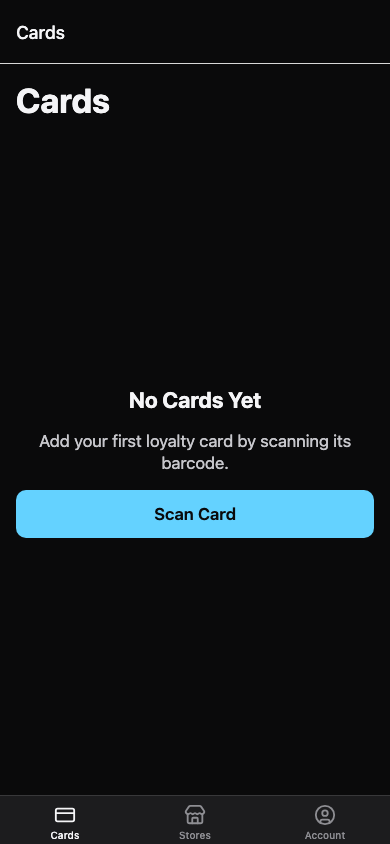
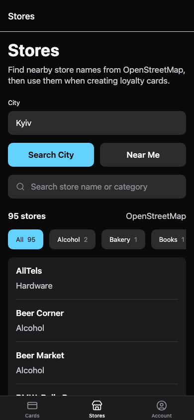
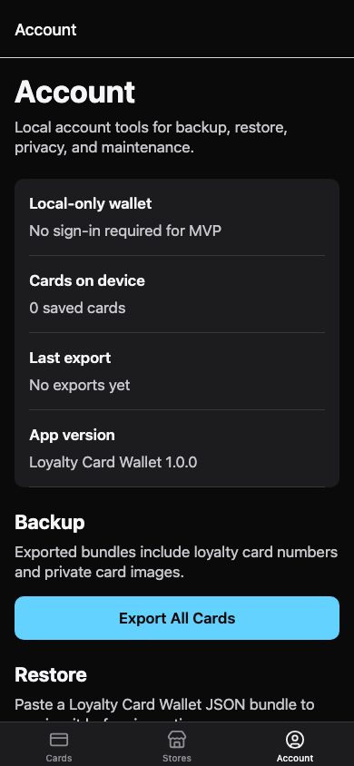
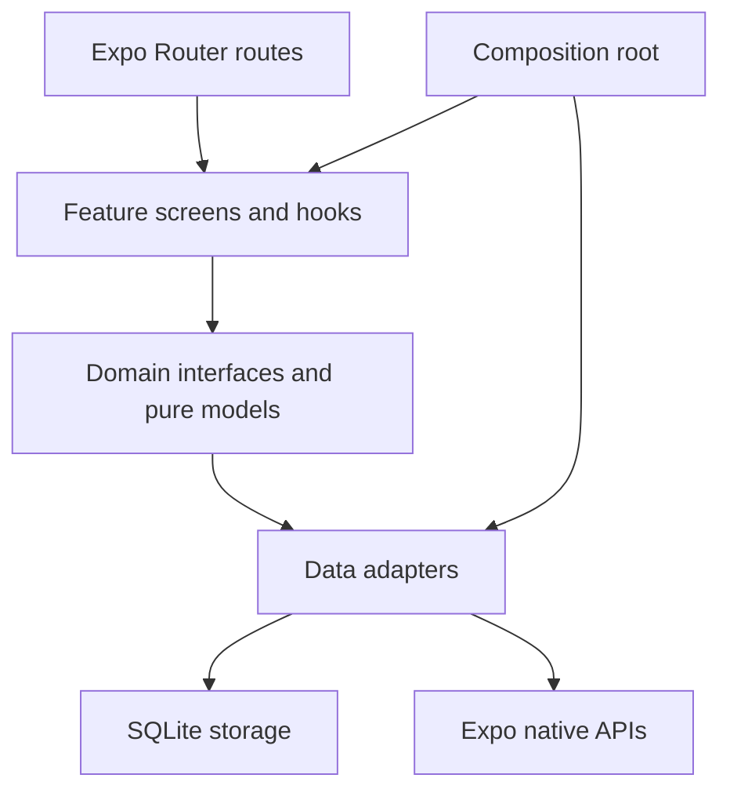

# Loyalty Card Wallet

[](https://github.com/ITC-Mobile-Team/loyalty-card-wallet/actions/workflows/ci.yml)


A local-first React Native wallet for loyalty cards, private card images, scanner-friendly barcodes, card sharing, and nearby store discovery.

The app is built with Expo, Expo Router, TypeScript, SQLite-backed local storage, and clean architecture boundaries documented under `docs/`.

## Preview

| Cards | Stores | Account |
| --- | --- | --- |
|  |  |  |

These screenshots are captured from the Expo Web smoke target. iOS and Android are the product platforms and still need native device QA for platform-specific behavior.

## Features

- Local-first SQLite storage for cards, image metadata, and export metadata.
- Private card image payloads stored behind the app data layer.
- Scanner-friendly barcode rendering for saved loyalty cards.
- JSON import/export for backup and restore.
- Single-card share links with preview-before-import behavior.
- Nearby store discovery powered by OpenStreetMap/Overpass.
- Clean architecture with injected repositories, adapters, and platform services.
- GitHub Actions CI for install, Expo compatibility, typecheck, lint, and tests.

## Architecture



The domain layer stays independent from React, Expo, SQLite, navigation, and network implementations. Platform and persistence details live behind data adapters and are wired in the composition root.

## Tech Stack

| Area | Choice |
| --- | --- |
| App framework | Expo React Native |
| Language | TypeScript |
| Navigation | Expo Router |
| Local storage | SQLite |
| Native APIs | Expo modules and local Expo module for iOS Vision barcode decoding |
| Maps | `expo-maps` with OpenStreetMap/Overpass discovery |
| Testing | TypeScript test build plus Node test runner |
| CI | GitHub Actions |

## Quick Start

Prerequisites:

- Node.js 22 LTS or another version accepted by the installed React Native packages.
- npm.
- Expo CLI through `npx expo`.
- Xcode with an iOS 18 simulator for iOS checks.
- Android Studio with an Android 11/API 30 emulator for Android checks.

Avoid Node.js 23 for routine work because current React Native packages print engine warnings for that range.

Install dependencies:

```sh
npm install
```

Run the automated baseline:

```sh
npx expo install --check
npx expo-doctor
npm run typecheck
npm run lint
npm test
```

GitHub Actions runs the same baseline on pushes and pull requests to `main`.

## Run The App

Start the standard Expo dev server:

```sh
npm run start
```

Run the browser smoke target:

```sh
npm run start:web
```

Open `http://localhost:8081` and verify the Cards, Stores, and Account tabs render.

For a physical device on the same local network:

```sh
npm run start:device
```

## Native Notes

Store detail uses `expo-maps` for the embedded map preview and `expo-clipboard` for coordinate copying. `expo-maps` is alpha and is not available in Expo Go, so embedded map QA must use native/development builds:

```sh
npm run ios
GOOGLE_MAPS_ANDROID_API_KEY=<restricted-key> npm run android
```

Do not commit Google Maps API keys. Android builds read `GOOGLE_MAPS_ANDROID_API_KEY` through `app.config.js`; after adding or changing the key, rebuild the native app.

## Scripts

| Script | Purpose |
| --- | --- |
| `npm run start` | Start Expo. |
| `npm run start:web` | Start Expo Web on localhost for app-shell smoke testing. |
| `npm run start:device` | Start Expo with LAN host for physical devices. |
| `npm run ios` | Build and run iOS locally. |
| `npm run ios:device` | Build and run iOS on a selected device. |
| `npm run android` | Build and run Android locally. |
| `npm run typecheck` | Run TypeScript without emitting files. |
| `npm run lint` | Run ESLint. |
| `npm test` | Compile tests and run Node's test runner. |

## Documentation

- Project documentation index: [docs/README.md](docs/README.md)
- Architecture: [docs/architecture/mobile-clean-architecture.md](docs/architecture/mobile-clean-architecture.md)
- Navigation contract: [docs/architecture/navigation-contract.md](docs/architecture/navigation-contract.md)
- Import/export contract: [docs/api/import-export.md](docs/api/import-export.md)
- Data migrations: [docs/data-model/migrations.md](docs/data-model/migrations.md)
- Design docs: [docs/design/README.md](docs/design/README.md)
- Mobile QA checklist: [docs/qa/mobile-qa-checklist.md](docs/qa/mobile-qa-checklist.md)

## Contributor Notes

- Keep project docs and instruction files in English.
- Use npm and keep `package-lock.json` current.
- Follow local project instructions before adding dependencies.
- Do not commit secrets, credentials, ignored local instructions, generated native folders, or private planning material.
