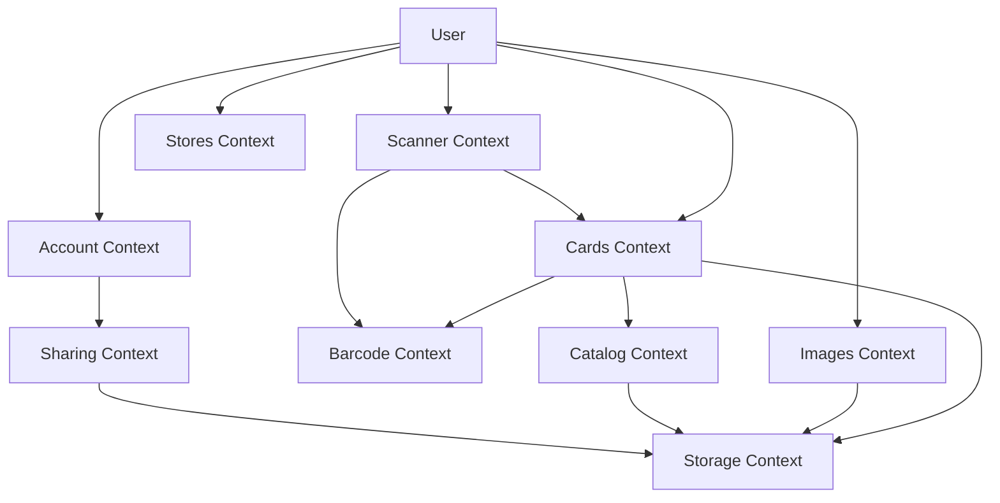

# Context Map

## Bounded Contexts

The MVP can be described through these contexts:

- Cards: saved loyalty cards, notes, pictures, and edit/delete behavior.
- Catalog: optional local brand metadata used to prefill card creation.
- Scanner: camera permissions, live scanning, and scan-from-photo behavior.
- Barcode: validation, format mapping, and barcode rendering.
- Images: image picking, cropping, private payload storage, thumbnails, and cleanup.
- Storage: SQLite migrations, repositories, and private image data.
- Sharing: import/export of local card data and images.
- Stores: city or nearby store discovery backed by OpenStreetMap data.
- Account: local settings, privacy notes, and sharing actions without sign-in.

## Visual Map

## Notes

- Scanner detects values; Barcode decides whether the value can be rendered and how to display it.
- Images owns private payload lifecycle so deleted cards do not leave unnecessary image data behind.
- Catalog is local for MVP and should not block adding custom cards.
- Stores does not depend on a public discounts API. It uses OpenStreetMap store data only for discovery.
