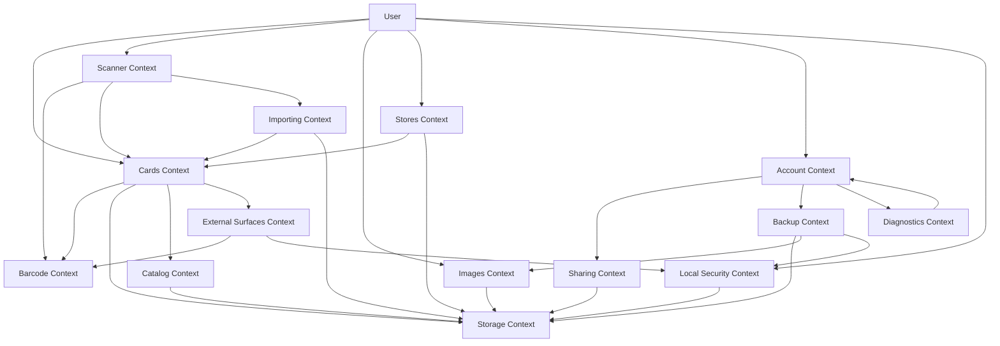

# Context Map

## Bounded Contexts

The MVP can be described through these contexts:

- Cards: saved loyalty cards, notes, pictures, and edit/delete behavior.
- Catalog: versioned local merchant metadata and user overrides used to prefill card creation.
- Importing: resumable normalized drafts created from multi-image barcode decoding.
- Scanner: camera permissions, live scanning, and scan-from-photo behavior.
- Barcode: validation, format mapping, and barcode rendering.
- Images: image picking, cropping, private payload storage, thumbnails, and cleanup.
- Storage: SQLite migrations, repositories, and private image data.
- Sharing: import/export of local card data and images.
- Backup: encrypted full-wallet recovery, payload migration, document providers, and restore results.
- Local Security: optional local authentication and root access policy.
- Diagnostics: bounded redacted local recovery evidence.
- External Surfaces: minimal opted-in card snapshots, phone widgets, revocation, and safe app deep links.
- Stores: city or explicit foreground nearby discovery, deterministic card suggestions, and user-owned merchant/store links backed by repairable OpenStreetMap evidence.
- Account: local recovery, security settings, privacy notes, and sharing actions without sign-in.

## Visual Map

## Notes

- Scanner detects values; Barcode decides whether the value can be rendered and how to display it.
- Images owns private payload lifecycle so deleted cards do not leave unnecessary image data behind.
- Catalog is local for MVP and should not block adding custom cards.
- Stores does not depend on a public discounts API. It uses OpenStreetMap store data only for discovery and repairable source evidence.
- Nearby suggestions read indexed card merchant projections and never mutate a link without explicit confirmation.
- Local merchant keys own the association; OSM element references may be repaired or removed.
- Sharing remains the selected-card and plaintext-v1 boundary. Backup is a separate encrypted recovery boundary.
- AccessGate protects rendered app content and sensitive export actions, but does not encrypt the SQLite database.
- Diagnostics are local, bounded, redacted before buffering, never uploaded automatically, and hidden from the normal Account screen unless explicitly exposed through a support or developer surface.
- External surfaces never read SQLite. The main app projects explicitly selected cards into a separate versioned snapshot and extensions fall back to the app for stale, revoked, missing, future-version, or corrupt content.
